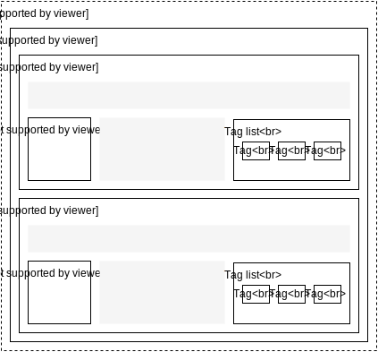
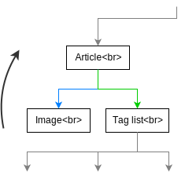

# ChameleonComponents
Silny nastroj na vytvaranie komponent ktore sa dokazu prisposobit svojmu prostrediu ako chameleon. Je urceny na vytvaranie jednoduchych komponent ktore sluzia na zobrazovanie dat. Ak komponneta vyzaduje zlozitejsiu logiku odporucam sa pozriet na cast Napojenie na ChameleonComponents. Tento plugin riesi 3 zakladne problemy.

- "komunikaciu medzi komponentami"
- nacitavanie dat
- optimalizacia dotazov
- automaticke pridanie cachovacich tagov komponente

## Casti ChameleonComponents
### DataLoaderPresenterListener
Napojenie vstupu udajjov o komponentach z presentra.

### DataLoader
Jadro pluginu. Sluzi na skombinovanie parametrov a nasledne nacitanie dat. Tato trieda vyuziva niekolko dalsich na rozdelenie prace do vymenitelnych celkov.

### DataSpaceBuilder
Cast DataLoadera ktora sluzi na rozdelenie vsetkych komponnet v presentri do celkov (DataSpace) ktore spolu suvisia vzhladom na ich priradeny typ. Komponenty ktorych parametre sa suvysia su vlozene do jedneho DataSpace. Kazda komponenta predava urcitu cast parametrov a tie sa spoja dokopy pre kazdy DataSpace.

Napriklad komponenta ArticleList vie aky typ dat chce nacitavat (ArticleEntity) ale nevie kolko. Paginator komponenta vie limit od akeho prvku sa maju vysledky zobrazovat a kolko ich ma byt. ChameleonComponents tieto parametre spoja a nacitaju uz len potrebne data do kazdej komponenty ktora ich potrebuje.

### IDataLoaderDriver
Je interface ktory musia implementovat vsetky mozne sposoby nacitavania dat. Najlepsie podporovanym sposobom je DoctrineDataLoaderDriver. Dalsim podpoorvanym bude elastic search.

DataLoader pri nacitavani dat vyberie ktory driver sa pouzije.

### AutomaticCache
Automaticky su kazdej komponente pridane tagy podla nazvov nacitanych typov.

### namespace Definition
Triedu sluziace podobe ako entity, na prenasanie stavu medzi jednotlivymi krokmi nacitavaina.

## DoctrineDataLoaderDriver
Sluzi na nacitavanie dat pomocou doctrine a nasich repository (vyuziva z nich funciu createQueryBuilder). Tento driver podporuje vsetky zakladne entity, filtrovanie podla criterii, automaticke filtrovanie podla nadradenych komponent.

# Lifecycle
Spracovanie komponent sa spusta po spusteni akcie v presentri, a pred spracovanim signalu (pretoze ten uz moze vyzadovat konkretnu komponentu napriklad z zoznamu). Spraovanie chameleona prebieha postupne:

1. Z stromu omponent v presentri sa vybuduje strom definicii (ControlDataDefinition). V tomto strome su len komponenty ktore mozu maju "DataDefinition" a mozu nejak ovplivnit vysledok.
2. Z stromu definicii sa vygeneruju DataSpace objekty, kazdy DataSpace sa da povazovat za jeden dotaz do databazy. DataSpace obsahuje vsetky spojene udaje o kazdom buducom dotaze. DataSpace objekty su takisto v stromovej strukture, avsak ta nemusi presne vystihovat povodny strom komponent (pretoze jedna komponenta moze mat viac DataSpace, alebo aj ziadne)
3. Spracuvava sa kazdy DataSpace osobitne. Spracuvavaju sa od vrchu stromu po vrstvach.
	3.1. Najde sa driver ktory ho dokaze spracovat. Napriklad entity dokaze spracovat Doctrine driver, dopredu pripravene hodnoty v statuse dokaze nacitat Status driver,..
	3.2. Driver pripravi callback ktory ulozi do statusu. Nespusta sa okamzite az v momente ked neikto tieto data vyzaduje. Takze ak je komponenta cachovana tak sa data ani nevyberu z databazy.
4. Ak sa narazilo na nejake definicie ktore vyzaduju novu kontrolu komponent tak sa zas ide od prveho kroku. Takuto kontrolu vyzaduju naprikald komponenty v listoch. Pretoze v momente ked sa spracoval list tak jeho obsah este ani neexistoval. Az po jeho spracovani sa naplnil komponentami.
5. Nakoniec sa kazdej spracovanej komponente pridaju tagy pre automaticke cachovanie.

# Jednoduche vyuzitie
Ak chceme vytvorit jednoduchu komponentu vykreslujucu jednoduchu entitu s vyuzitim ChameleonComponents budeme musiet do halvicky triedy pridat ```implements Wame\ChameleonComponents\IO\DataLoaderControl``` a implementovat methodu ktora bude vraciat definiciu dat ake komponenta potrebuje.

```
class ArticleControl extends BaseControl implements DataLoaderControl {
    public function getDataDefinition()
    {
        return new DataDefinition(new DataDefinitionTarget(ArticleEntity::class, false));
    }
    
    public function render()
    {
        $this->template->entity = $this->getStatus()->get(ArticleEntity::class);
    }
}
```

Pri opuziti tohto zapisu by sa do statusu dostal jeden clanok. Ten by sa nacital bud podla nejakej realcie s inymi komponentami alebo z statusu. Ale lepsie je na taketo veci pouzit uz pripravenu abstraktnu komponentu ```Wame\ChameleonComponents\Components\SingleEntityControl```. Ta zabezpecuje aj dalsie sposoby nacitania entity (priamim rpedanim entity v construct, v statuse, cez chameleon components, podla zadaneho id). SingleEntityControl ma entitu dostupnu pri rendrovani v template pod premennou $entity.

```
class ArticleControl extends SingleEntityControl
{
    protected function getEntityType()
    {
        return ArticleEntity::class;
    }
}
```

## Ako mozu vyzerat definicie komponent
Definicia by mala obsahovat vsetky data ktore chce nacitat a informacie ktore o tychto typoch vie. Informacie ktore vie sa predavaju v Criteriaobjekte. Mozu obsahovat napriklad konkrtnu hodnotu (id = 3), filter (date > 20.2.2002), mozu urcovat poradie (order) alebo limit. Nacitane data potom najde v statuse komponenty (aj presenter sa povazuje za komponentu).

Mozu byt zavysle na statuse, parametroch komponenty (napriklad z databazy, pozicie) a vsetkom dostupnom v __constructe komponenty.

```
public function getDataDefinition()
{
    $criteria = null;
    if ($this->articleId) {
        $criteria = Criteria::create()->where(Criteria::expr()->eq('id', $this->articleId));
    }
    return new DataDefinition(new DataDefinitionTarget(ArticleEntity::class, false), $criteria);
}
```

Nemozu byt zavysle na veciach ktore sa naplnia az po spracovani action. Takze nemozeme pouzit parametre predavane v render, pouzitu render funkciu, ale ani url parametroch komponenty kedze este nemusi byt attachnuta na spravnom mieste (napriklad pri liste).

NOTICE: TATO CAST ESTE NEFUNGUJE; 
Po spracovani signalu moze komponenta vraciat inu definiciu. To je znak toho ze sa maju tieto komponenty signalom prekreslit.

# Napojenie na ChameleonComponents
Kedze ChameleonComponents nacitavaju data do "stavu" komponent, je jednoduche sa k nim tymto sposobom dostat. Nacitaju sa tam medzi spracovanim signalu a volanim beforeRender. Staci vediet meno statusu pod akym je ulozeny. Ako mena sa pouzivaju mena typov (classy entit) z definicie. Napriklad ```$this->getStatus()->get(ArticleEntity::class);```.

# Relacie
Kazda stranka je zlozena z komponent, tie su umiestnene priamo alebo v poziciach. Na tom pri spracovani chameleonom nezapezi. Nasledujuci text o relaciach bude pracovat s takouto strankou:



## Smerom hore


Komponenty su poskladane v strome. Pri vyhladavani moznych realcii sa postupuje v strome od komponenty smerom nahor. Vsetky mozne relacie tymto smerom sa automaticky pridaju. To znamena ze Image komponenta je automaticky zviazana s clankom ktory jed nad nou. Preto zobrazi obrazok ktory sa viaze na konkretny clanok.



Takymto sposobom nemusia byt zviazane len jednotlive komponenty ale aj listy. Napriklad zoznam tagov pre clanok.

## Smerom dole
Relacie tymto smerom niesu na rozdiel od smeru hore pridane automaticky. Tento smer musia komponnety zadefinovat do niektorej svojej definicie. Pridavaju sa pomocou methody ```addRelation```

```
$dataDefinition = new DataDefinition(new DataDefinitionTarget(ArticleEntity::class, true));
$relationCriteria = Criteria::create()->where(Criteria::expr()->in('category', $categoriesArray));
$dataDefinition->addRelation(new DataDefinitionTarget(CategoryEntity::class, true), $relationCriteria)
```

Tento zapis prida filter na Article list. Zobrazi len clanky ktore maju su pridane v niektorej z kategorii v $categoriesArray.

V relaciach smerom dole sa nieje mozne odvolat na hodnotu priamo z komponenty pretoze komponenty nizsie v strome este neisu spracovane. (Strom komponent sa spracuvava od vrchu po vrstvach.) Pri relaciach smerom hore (predchadzajuca cast) neiej potrebne relaciu ani specialne pridavat ani urcovat hodnotu. U tychto relacii je potrebne ju specifikovat a aj predat potrebne hodnoty pomocou kriterii.